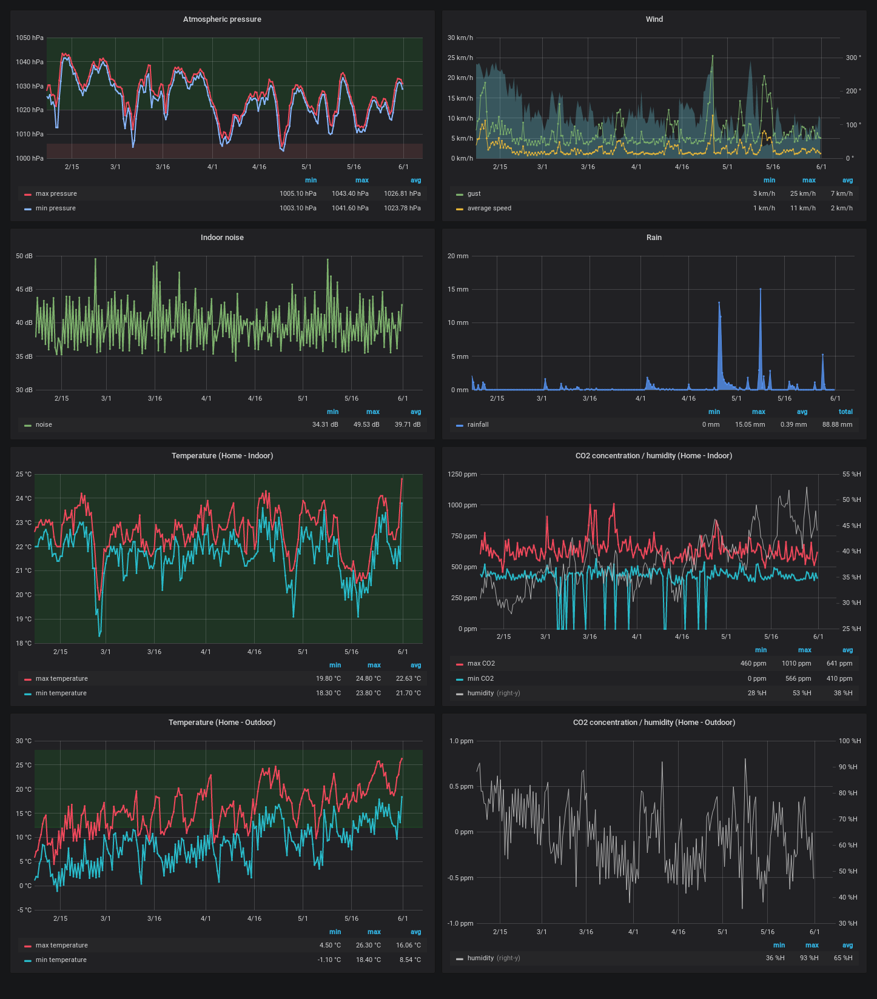

# Netatmo collector

[](https://www.gnu.org/licenses/agpl-3.0)
[](https://github.com/nioc/netatmo-collector/releases/latest)
[](https://www.codacy.com/app/nioc/netatmo-collector)

Netatmo collector is a PHP script for requesting measures from Netatmo devices.

## Key features

-   Automatic script (can be used with cron for example),
-   Initialization step (providing a start date and wait for the magic),
-   Store measures into an InfluxDB database,
-   Explore data with Grafana.



## Installation

### Script

Download this project and extract files to directory of your choice.

In order to authenticate yourself on the Netatmo API, you must:

-   create a Netatmo [application](https://dev.netatmo.com/myaccount/createanapp),
-   generate a token with `read_station` scope,
-   enter your `client_id` and `client_secret` values in `config.php`,
-   create a `tokens.json` file with this content (replace the 2 values between `<>` with your tokens):

``` json
{"access_token":"<yourAccessToken>","refresh_token":"<yourRefreshToken >","scope":["read_station"],"expires_in":10800,"expire_in":10800,"expires_at":0}
```

### Dependencies

Install dependencies with [composer](https://getcomposer.org/): `composer install`.

### InfluxDB

You need [InfluxDB](https://docs.influxdata.com/influxdb/v1.7/introduction/installation/) installed.

Default values are ok, but configuration can be changed (see [docs](https://docs.influxdata.com/influxdb/v1.7/administration/config/)).

Script will create database.

### Grafana

You need [Grafana](https://grafana.com/grafana/download) installed.

Import [JSON file](dashboard.json) from Grafana GUI (Create / Import).

Create InfluxDB data source, mainly name and influxDB URL, for example:  `http://localhost:8086` (Configuration / Data sources / Add).

Configure dashboard variables (Dashboard / Settings / Variables):

-   `datasource` = the data source name you set up,
-   `devices` = the Netatmo station name (only one station by dashboard),
-   `modules` = comma separated list of modules name,
-   `windGauge` = wind gauge module name (obviously),
-   `rainGauge` = rain gauge module name (obviously),
-   `mainModule` = main module name (obviously).

## Usage

### Initialization

In order to collect oldest measures, script accepts a start date (YYYY-MM-DD) as an optional argument.

Open a shell, go in script directory and execute it: `php -f index.php 2018-12-31`.

### Scheduling repeated executions

Add to your scheduler (cron for exemple) following command (change the path `/usr/local/bin/netatmo-collect/` according to your installation):

```shell
# /etc/cron.d/netatmo-collect: crontab fragment for requesting Netatmo measures
# Requesting Netatmo measures and storing to database every 12 hours
 0 */12    * * *     root   php -f /usr/local/bin/netatmo-collect/index.php >> /var/log/syslog 2>&1
```

### Logs

Log settings can be found in `config.xml` file.

In production mode, the default configuration use a file (`netatmo-collect.log`) for logging at level `INFO`.

For debugging, you can output to console and set a more verbose level (`DEBUG` or even `TRACE`) by overriding the `root` section:

```xml
  <root>
    <level value="DEBUG"/>
    <appender_ref ref="console"/>
  </root>
```

## Versioning

This project is maintained under the [semantic versioning](https://semver.org/) guidelines.

See the [releases](https://github.com/nioc/netatmo-collector/releases) on this repository for changelog.

## Contributing

Pull requests are welcomed.

## Credits

-   **[Nioc](https://github.com/nioc/)** - _Initial work_

See also the list of [contributors](https://github.com/nioc/netatmo-collector/contributors) to this project.

This project is powered by the following components:

-   [Netatmo-API-PHP](https://github.com/Netatmo/Netatmo-API-PHP)
-   [influxdb-php](https://github.com/influxdata/influxdb-php) (MIT)
-   [Apache log4php](http://logging.apache.org/log4php/) (Apache License)

## License

This project is licensed under the GNU Affero General Public License v3.0 - see the [LICENSE](LICENSE.md) file for details.
